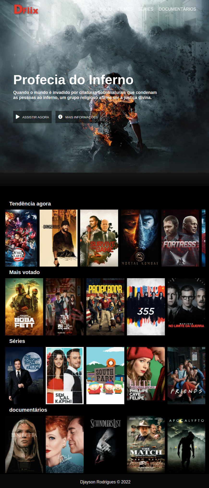

<h1 align="center">
       
</h1>
 
## 💻 Projeto

O projeto **DFlix** é um aplicação Web que consiste em um site de Streaming similar ao da Netflix.

<h1 align="center">
    
</h1>

## 🚀 Tecnologias

- HTML
- CSS
- JAVASCRIPT
- API DA TMDB
- OWL CAROUSEL

## ℹ️ Como Executar

1. Faça um clone do repositório:

```sh
  $ git clone https://github.com/Djaysson/Dflix.git
```

2. Executando a Aplicação:

```sh
  # Vá para o repositório
  $ cd Dflix

  # Execute o site
  $ click no arquivo index.html
```

Feito com ❤️ por Djayson Rodrigues 👋 [Entrar em contato!](https://www.linkedin.com/in/djaysonrodrigues/)
